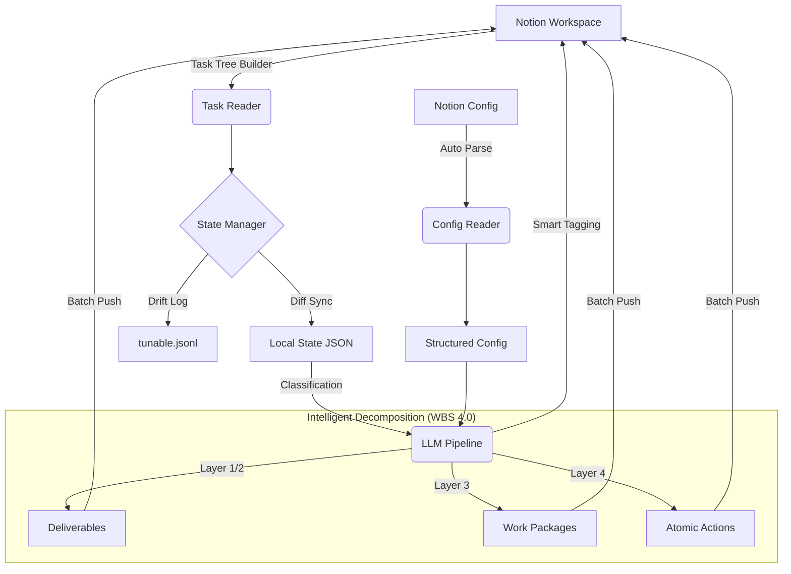

# YoncAgent (Notion Task Management System)

YoncAgent 是一个专为 INTP + ADHD 人群设计的智能 Notion 任务管理与增强系统。系统基于 Python 并整合了 DSPy 与 Gemini / 多模型能力，旨在辅助前额叶功能，将抽象宏大的目标强制“降维”拆解为可执行的物理动作。

## 🌟 核心理念与亮点功能

- **自动化同步引擎 (Sync Engine)**：无缝拉取 Notion 页面内容，通过本地 JSON 状态文件进行 Diff 比对，并在冲突时记录偏好习惯到 `tunable.jsonl` 以供长期微调。
- **WBS 4 级任务分解 (Nano-Slicing)**：运用 WBS (Work Breakdown Structure) 专业方法论，将任何任务精准划分为：Deliverables → Work Packages → Activities → Atomic Actions。
- **OKR 与 WBS 双逻辑判定**：系统会自动识别任务属性。项目类任务走 WBS 确定性分解（名词驱动）；探索类任务走 OKR 愿景分解（目标驱动）。
- **动态配置管理 (Config Reader)**：通过 Notion Config Page 联动，自动解析 Themes, Modes, Priorities 等个性化规则。
- **多 Key 负载均衡 (Unlimited LLM API)**：内置多 API Key 自动切换与用量平衡机制，解决单 Key 限流瓶颈，支撑高频大规模任务拆解。

## 🏗️ 架构与数据流 (Architecture & Workflow)



## 📂 核心文件目录结构

- `main.py`: CLI 入口。支持 `sync`, `tag`, `split`, `poll` 等核心指令。
- `llm_pipeline.py`: **核心大脑**。定义 WBS 分类器 (ClassifyTask) 与各层级精炼器 (RefineL1-L4)，使用 DSPy 进行类型安全约束。
- `sync_engine.py`: 处理 Notion Block 的深度写入与状态同步，包含防重复写入逻辑。
- `config_reader.py`: 解析 Notion 配置页，支持颜色转换（Task Theme with colour）及 Emoji 匹配。
- `unlimited_llmapi/`: **基础设施层**。管理多模型 API Key 的轮询切换、报错重试与 Token 优化。
- `state_manager.py`: 本地文件持久化，确保同步过程中数据的原子性。

## 🎯 WBS 任务分解方法论

系统严格遵循以下 4 级分层逻辑，确保任务“零决断点”：

| 层级 (Level) | 名称 | 核心定义 | 语法规范 |
| :--- | :--- | :--- | :--- |
| **L1** | **Goal** | 最终交付的目标或愿景 | 名词/动名词 |
| **L2** | **Deliverable** | 为达成 L1 所需的核心组件 | **名词** (MECE原则) |
| **L3** | **Work Package** | 完成 Deliverable 的具体工作包 | **名词** |
| **L4** | **Activity** | 最小颗粒度的执行步骤 | **动词 + 物理动作** |
| **Atomic** | **Refinement** | 针对 L4 的执行细节增强 | 预测耗时 (<=2h) |

> [!TIP]
> **OKR 模式**：当 L1 任务被定义为探索性（OKR）时，系统不仅生成分解项，还会自动提取 **Objective** 与 **Key Results** 以保持目标对齐。

## 🚀 快速开始

### 预备环境
1. Python 3.10+
2. 安装依赖：`pip install -r requirements.txt`
3. 配置 `.env` 文件：
   ```env
   NOTION_API_KEY=secret_xxx
   YONCTASK_CONFIG_PAGE_ID=page_id_xxx
   ```

### 配置 API Keys (多 Key 模式)
在 `unlimited_llmapi/api_keys.json` 中添加你的 Gemini Keys，系统将自动进行负载均衡：
```json
[
  {"key": "YOUR_KEY_1", "model": "gemini-1.5-flash"},
  {"key": "YOUR_KEY_2", "model": "gemini-1.5-flash"}
]
```

### 命令行参考
```bash
# 同步状态
python main.py sync
# 智能补充标签 (Themes & Modes)
python main.py tag
# 执行 4 级 WBS 任务拆解
python main.py split
```

## 🛡️ 背景与贡献
该项目旨在通过 LLM 协助构建一个“外挂前额叶”，让 ADHD 使用者不再面对模糊的任务卡住，而是直接看到“伸出手，拿起杯子”级别的动作指令。

欢迎通过 `tunable.jsonl` 提供反馈，帮助优化分解算法的个性化参数。
