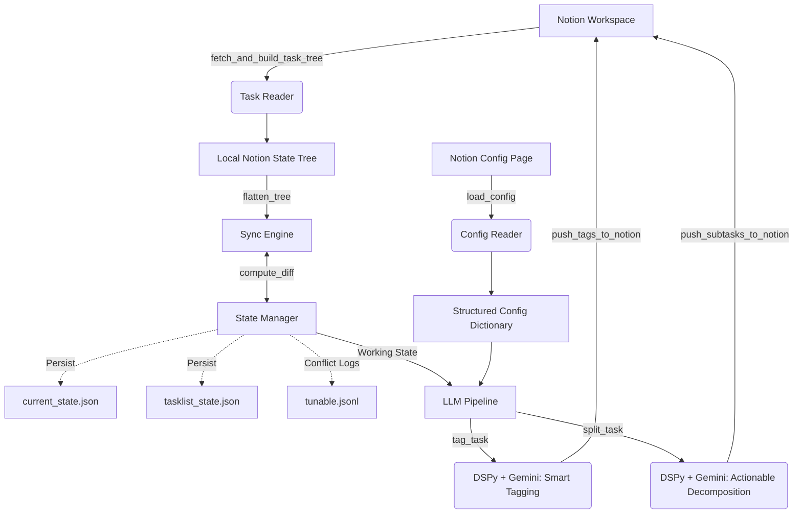

# YoncAgent (Notion Task Management System)

YoncAgent 是一个专为 INTP + ADHD 人群设计的智能 Notion 任务管理与增强系统。系统基于 Python 并整合了 DSPy 与 Gemini / 多模型能力，能够自动同步 Notion 任务平台的状态，智能地补充任务标签（Tags、Themes、Modes），并将引发执行障碍的抽象宏大任务强制“降维”分解为极简物理动作。

## 🌟 核心理念与亮点功能

- **自动化同步引擎 (Sync Engine)**：无缝拉取 Notion 任务状态，通过本地 JSON (`current_state.json`, `tasklist_state.json`) 进行 Diff 比对与状态合并，并在冲突时记录偏好习惯到 `tunable.jsonl` 以供长期微调。
- **动态配置管理 (Config Reader)**：所有“优先级”、“主题色彩”和“模式”配置都通过 Notion Config Page (块内容) 集中获取，自动解析出结构化设置。
- **前额叶代偿功能 (LLM Pipeline)**：
  - **标签补充 (`tag`)**：调用大语言模型，自动根据配置推断出适合当前任务的 Emoji 标签、主题类型与执行模式，并将丰富样式的 Text Attributes 反推至 Notion（支持✅已完成任务的灰态处理）。
  - **任务降智切割 (`split`)**：运用 Nano-Slicing 原则，将高认知负载的模糊任务转化为“不超过 60 秒”和“零决断点”的最底层物理肌肉动作（肌肉级 Subtasks）。

## 🏗️ 架构与数据流 (Architecture & Workflow)



## 📂 核心文件目录结构

- `main.py`: CLI 命令行入口点与核心宏观流程控制。
- `sync_engine.py`: Notion 与本地状态的增量同步逻辑，包含 diff 判断、冲突日志记录以及 Notion 内容块写入逻辑。
- `llm_pipeline.py`: DSPy Signature 定义，处理复杂的“肌肉动作拆解”与“属性Tag生成”。
- `config_reader.py`: 从指定 Notion Widget/Database 读取用户偏好配置，解析出 `themes`, `modes`, `priorities`, `task_states` 等规则树。
- `state_manager.py`: 管理扁平化与层级化 JSON 状态文件交互并处理层级合并。
- `notion_client.py`: 对 Notion API 接口的无状态封装层（如获取块、修改块、删除块等）。
- `tunable.jsonl`: 用户手动操作与状态漂移日志，未来支撑推荐算法与行为学习分析。

## 🚀 快速开始

### 预备环境
请确保安装了 Python 3.10+，并配置相关环境变量。系统强依赖 `dspy` 与自定义 `unlimited_llmapi` 服务模块。

在项目根目录创建一个 `.env` 并在其中声明以下必要配置（具体配置项可参考 `config.py`）：
```env
NOTION_API_KEY=your_notion_secret
YONCTASK_CONFIG_PAGE_ID=notion_page_id_for_config
GEMINI_API_KEY=your_gemini_api_key  # 如果需要默认的 fallback
```

### 命令行参考
可通过 `main.py` 驱动 YoncAgent 的不同管线阶段：

```bash
# 1. 查看已解析的 Notion 当前配置快照
python main.py show-config

# 2. 从 Notion 同步数据，解决冲突并生成本地合并状态
python main.py sync

# 3. 让 LLM 为未归类任务补全主题标签和状态图标，并推回 Notion
python main.py tag

# 4. 触发分解管线：将所有抽象节点打碎为物理可执行的微小步骤，并写入 Notion
python main.py split

# 5. 守护进程运行模式：定期自动执行拉取、判断、合并操作
python main.py poll
```

## 🛡️ 代码协作与扩展须知

1. **Dry Run 原则**: 在重构对 Notion 重度写入操作的逻辑前，确保仅输出变更内容（`print` 或 `json` dump）而不要真的调用 `update_block`。
2. **提示词调试**: 如果对 `split` 拆解颗粒度不满意，可进入 `llm_pipeline.py` 修改 `SplitAbstractTask` DSPy Signature 中的 `# Output Constraints`。
3. **保持类型安全**: 请积极使用并更新 `typing.Dict`, `typing.List` 等类型提示，降低 Python 鸭子类型带来的运行时风险。
