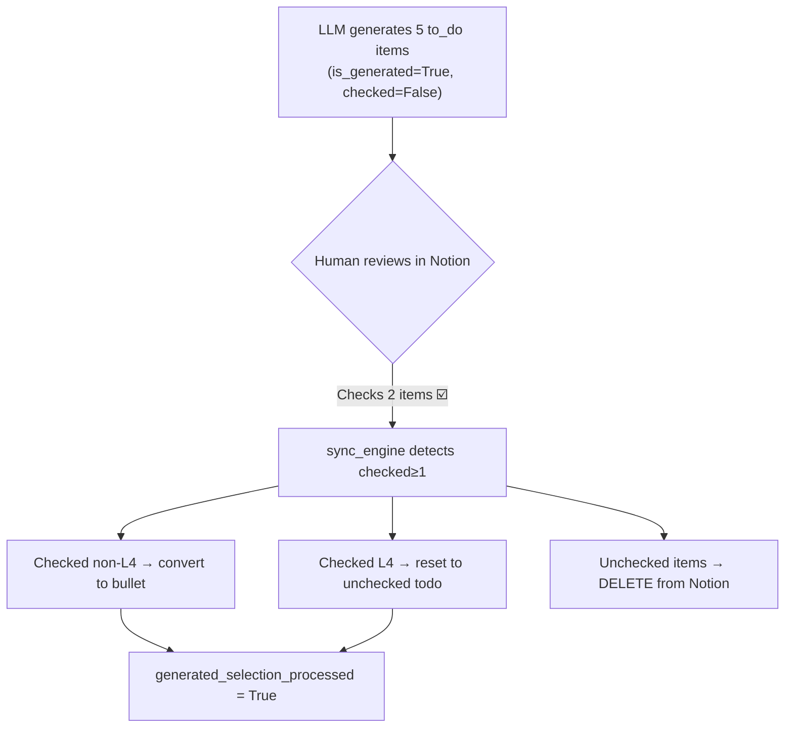

```mermaid
graph LR
    RAW --> STRUCTURED
    STRUCTURED --> SCOPED
    SCOPED --> SEQUENCED
    SEQUENCED --> EXPANDING
    EXPANDING --> HUMAN_REVIEW
    HUMAN_REVIEW -->|human checks ✅| PHASING_WAIT
    PHASING_WAIT -->|human assigns 1️⃣2️⃣| ACTIONABLE_PENDING
    ACTIONABLE_PENDING --> READY
    READY -->|human checks ☑️| COMPLETED

    style RAW fill:#ff6b6b,color:#fff
    style HUMAN_REVIEW fill:#ffd93d,color:#333
    style PHASING_WAIT fill:#ffd93d,color:#333
    style READY fill:#6bcb77,color:#fff
    style COMPLETED fill:#4d96ff,color:#fff
```

# Block Lifecycle States — `python main.py flow`

> **Engine**: [`state_evaluator.py`](../state_evaluator.py) · `evaluate_block_state()`
>
> This document describes the **state-driven architecture** that replaced the legacy `flow-l1 / l2 / l3` pipeline.  
> Each Notion block is evaluated independently. The system identifies what the block is **missing**, then applies only the specific transform needed to advance it.

---

## Overview Diagram



> 🟡 Yellow = **Halted (waiting for human)**  
> 🔴 Red = **Unprocessed**  
> 🟢 Green = **Ready for execution**  
> 🔵 Blue = **Done**

---

## State Definitions

Each state below documents:
1. **What the system reads** (Pattern Recognition — exact field checks)
2. **What the system does** (Action)

The evaluation order matters — the first matching state wins (top-down priority).

---

### `COMPLETED`

> **Evaluation Priority: 1st (checked first)**

| Aspect | Detail |
|---|---|
| **Pattern** | `notion_type ∈ {"to_do", "todo"}` **AND** `checked == True` **AND NOT** (`is_generated == True` **AND** `generated_selection_processed == False`) |
| **Meaning** | A to-do block that the human has physically checked off in Notion. The extra guard clause excludes LLM-generated suggestion checkboxes that the user ticked to "approve" (those are selection signals, not completion signals). |
| **System Action** | None. Block is considered done. Archived during dashboard refresh. |
| **Human Action** | Check a `to_do` checkbox in Notion. |

**Code reference** — [state_evaluator.py L114–L118](../state_evaluator.py#L114-L118):
```python
if notion_type in ("to_do", "todo") and checked is True and not (
    is_generated and not generated_selection_processed
):
    return BlockState.COMPLETED
```

# Block Lifecycle States — `python main.py flow`

> **Engine**: [`state_evaluator.py`](../state_evaluator.py) · `evaluate_block_state()`
>
> This document describes the **state-driven architecture** that replaced the legacy `flow-l1 / l2 / l3` pipeline.  
> Each Notion block is evaluated independently. The system identifies what the block is **missing**, then applies only the specific transform needed to advance it.

---

## Overview Diagram


> 🟡 Yellow = **Halted (waiting for human)**  
> 🔴 Red = **Unprocessed**  
> 🟢 Green = **Ready for execution**  
> 🔵 Blue = **Done**

---

## State Definitions

Each state below documents:
1. **What the system reads** (Pattern Recognition — exact field checks)
2. **What the system does** (Action)

The evaluation order matters — the first matching state wins (top-down priority).

---

### `COMPLETED`

> **Evaluation Priority: 1st (checked first)**

| Aspect | Detail |
|---|---|
| **Pattern** | `notion_type ∈ {"to_do", "todo"}` **AND** `checked == True` **AND NOT** (`is_generated == True` **AND** `generated_selection_processed == False`) |
| **Meaning** | A to-do block that the human has physically checked off in Notion. The extra guard clause excludes LLM-generated suggestion checkboxes that the user ticked to "approve" (those are selection signals, not completion signals). |
| **System Action** | None. Block is considered done. Archived during dashboard refresh. |
| **Human Action** | Check a `to_do` checkbox in Notion. |

**Code reference** — [state_evaluator.py L114–L118](../state_evaluator.py#L114-L118):
```python
if notion_type in ("to_do", "todo") and checked is True and not (
    is_generated and not generated_selection_processed
):
    return BlockState.COMPLETED
```

---

### `SKIP`

> **Evaluation Priority: 2nd**

| Aspect | Detail |
|---|---|
| **Pattern** | `is_content_block == True` **OR** `notion_type ∈ {"paragraph", "heading_1", "heading_2", "heading_3", "quote"}` |
| **Meaning** | Content blocks (like images, bookmarks) and structural container blocks (section headings like "婚姻", "科研人", quotes) that exist only to provide context. They are never assigned tags, WBS, or processed as tasks. |
| **System Action** | Completely ignored by the evaluator loop. |
| **Human Action** | None needed. |

---

### `RAW`

> **Evaluation Priority: 3rd**

| Aspect | Detail |
|---|---|
| **Pattern** | `tags["Task Theme with colour"]` is **empty or missing**. |
| **Meaning** | A newly added block that has no semantic theme assigned yet. The system doesn't know which project/domain this task belongs to. |
| **System Action** | **Theme Resolution** (`theme_pass`): Scans the block title, parent chain, context heading, and neighboring paragraph blocks to infer the correct Theme from `YONCTASK_CONFIG`. Then **Reparenting** (`reparent_theme_containers`): Moves the block under the correct parent container if it's misplaced. |
| **Fields Written** | `tags["Task Theme with colour"]`, `theme_display_label` |
| **Advances To** | `STRUCTURED` |

**What `theme_pass` reads to determine theme**:
1. Direct parent → parent of parent chain (highest priority)
2. Ancestor prefix embedded in the flattened `title` field
3. Explicit `context_heading` from surrounding paragraph blocks
4. Neighboring ±2 blocks that are paragraph-type section headers

---

### `STRUCTURED`

> **Evaluation Priority: 4th**

| Aspect | Detail |
|---|---|
| **Pattern** | Has `tags["Task Theme with colour"]` **BUT** `wbs_level == None`. |
| **Meaning** | The block is categorized under a theme but we don't yet know its scale — is it a massive project (Lv1), a module (Lv2), a work package (Lv3), or an executable action (Lv4)? |
| **System Action** | **WBS Calculation** (`wbs_pass`): For `depth == 0` blocks, auto-assigns Lv1. For `depth == 1`, calls LLM `classify_task()` to determine the level. For `depth > 1`, infers from parent level (`parent_level + 1`, capped at 4). |
| **Fields Written** | `wbs_level` (int 1–4), `wbs_source` ("manual" or "auto"), `tags["WBS level"]` |
| **Advances To** | `SCOPED` |
| **LLM Cost** | 1 API call per `depth == 1` block (classification only). |

---

### `SCOPED`

> **Evaluation Priority: 5th**

| Aspect | Detail |
|---|---|
| **Pattern** | `wbs_level != None` **BUT** `timeliner_rank == None`. |
| **Meaning** | The block has a WBS level but hasn't been linked to any active project/subproject in the TIMELINER schedule. Without scope, the system can't determine priority or decide whether to invest LLM tokens on this block. |
| **System Action** | **Scope Anchoring** (`build_timeliner_scope`): Cross-references the block's theme and title against `timeliner_state.json` entries. Matches are based on `colour_subtheme` appearing in the title AND `project/subproject` appearing in the theme field. |
| **Fields Written** | `timeliner_key`, `timeliner_rank` (int), `timeliner_is_subproject`, `timeliner_priority`, `timeliner_section` |
| **Advances To** | `SEQUENCED` |
| **Note** | Blocks that don't match any TIMELINER entry stay at `SCOPED` indefinitely. This is **by design** — unscheduled tasks are deprioritized. |

---

### `SEQUENCED`

> **Evaluation Priority: 6th**

| Aspect | Detail |
|---|---|
| **Pattern** | `timeliner_rank != None` **BUT** `tags["Priority"]` is **empty**. |
| **Meaning** | The block is scoped to an active project but hasn't been assigned a priority rank (P0/P1/P2). |
| **System Action** | **Priority Calculation** (`priority_pass`): Sorts all root-level scoped tasks by `timeliner_priority` and `timeliner_rank`, then assigns P0 (idx 0), P1 (idx 1–2), P2 (idx ≥3). Also performs **Physical Ordering**: reorders root blocks in Notion by rank, and within each project, reorders depth=1 children by their Phase emoji (`1️⃣` before `2️⃣` before `3️⃣`). |
| **Fields Written** | `tags["Priority"]` |
| **Advances To** | `EXPANDING` (if WBS < 4 and no children) or `ACTIONABLE_PENDING` (if WBS = 4) |

---

### `EXPANDING`

> **Evaluation Priority: 7th**

| Aspect | Detail |
|---|---|
| **Pattern** | ALL of the following must be true: |
| | • `wbs_level < 4` (broad task, not a leaf action) |
| | • `split_stage ∉ {"suggested", "processed"}` (never been split before) |
| | • `is_generated == False` **OR** `generated_selection_processed == True` (generated tasks can be recursively split only after human selection) |
| **Meaning** | A broad task (project/module/work-package) that has not yet been processed for subtask decomposition. The system will use LLM to decompose it into actionable items. |
| **System Action** | **Task Splitting** (`split_task`): Calls the WBS decomposition pipeline. L1 goals → L2 deliverables. L2 modules → L3 work packages. L3 packages → L4 physical actions. Generated subtasks are inserted as `to_do` blocks under this parent in Notion. |
| **Fields Written** | `split_stage = "suggested"`, `split_batch_id = <ISO timestamp>` |
| **Anti-Regeneration Guard** | Once `split_stage` becomes `"suggested"` or `"processed"`, the block will **never** enter `EXPANDING` again, even on rerun. This prevents infinite LLM generation loops. |
| **Advances To** | `HUMAN_REVIEW` |
| **LLM Cost** | 2+ API calls (1 for classification, 1+ for decomposition). |

**Code reference** — [state_evaluator.py](../state_evaluator.py):
```python
children = children_by_parent.get(tid, [])
if isinstance(wbs_level, int) and wbs_level < 4:
    never_split = split_stage not in _ALREADY_SPLIT_STAGES
    
    if never_split and (not is_generated or generated_selection_processed):
        return BlockState.EXPANDING
```

---

### `HUMAN_REVIEW`

> **Evaluation Priority: 8th · ⚠️ HALTS PROCESSING**

| Aspect | Detail |
|---|---|
| **Pattern (Parent)** | `split_stage == "suggested"` **AND** at least one child block has `is_generated == True` **AND** `generated_selection_processed == False`. |
| **Pattern (Leaf)** | `wbs_level == 4` **AND** `is_generated == True` **AND** `generated_selection_processed == False`. |
| **Meaning** | The LLM has generated candidate subtasks (or this IS a generated candidate). The system is waiting for the human to review them in Notion. The human signals approval by checking the `to_do` checkbox on preferred suggestions. |
| **System Action** | **Halt until human selection.** On the next `flow` run, `push_tags_to_notion()` handles the review confirmation before the Mode/TaskType pass runs. |
| **Human Action Required** | Open Notion → Review the generated `to_do` items → Check ☑️ the ones you want to keep. Unchecked items will be deleted on next `flow` run. |
| **What Happens After Human Acts** | On next `flow` run, `sync_engine.py` detects that ≥1 generated child is checked. It sets `split_stage = "processed"` on the parent. Checked non-L4 items are converted to `bulleted_list_item`. Checked L4 items are reset to `checked=False` (unchecked todo, ready for actual execution). Both get `generated_selection_processed = True`. Unchecked generated items are **deleted**. Alternatively, if all generated items are deleted or processed, the evaluator auto-transitions the parent `split_stage` to `"processed"` at the start of the next evaluation. |
| **Advances To** | `PHASING_WAIT` (for depth=1 modules) or `ACTIONABLE_PENDING` (for L4 leaves) |
| **Generated L4 WBS Restore** | When the selected item is a generated L4 task, `push_tags_to_notion()` restores `tags["WBS level"]` during the same confirmation render. That means the visible WBS prefix should reappear together with Mode/TaskType formatting after review. |

**The selection mode lifecycle in detail**:



For generated L4 selections, the same confirmation render restores the WBS tag before the row is rewritten. The later Mode/TaskType render should therefore include the WBS prefix instead of leaving it hidden.

---

### `PHASING_WAIT`

> **Evaluation Priority: 9th · ⚠️ HALTS PROCESSING**

| Aspect | Detail |
|---|---|
| **Pattern** | `depth == 1` **AND** `wbs_level ∈ {2, 3}` **AND** the task title does **NOT** contain any phase emoji (`0️⃣` through `9️⃣`). |
| **Meaning** | This is a major module directly under a project root. The system needs the human to manually decide execution order (which modules to work on first). |
| **System Action** | **Halt.** The block and its entire subtree will not receive Mode/TaskType tags until a phase is assigned. This saves LLM tokens on modules the human hasn't prioritized yet. |
| **Human Action Required** | Either: |
| | **Option A (Notion)**: Edit the block title in Notion and prepend a phase emoji: `1️⃣ Define architecture` |
| | **Option B (CLI)**: Run `python main.py phase` → Select project → Type phase numbers like `1 1 2 3` |
| **Phase Emoji Reference** | `0️⃣`=Phase 0 (prep), `1️⃣`=Phase 1, `2️⃣`=Phase 2, ... `9️⃣`=Phase 9 |
| **Detection Logic** | `detect_phase_emoji(title)` scans for Unicode sequences `\d\uFE0F\u20E3` |
| **Advances To** | `ACTIONABLE_PENDING` (on next `flow` run) |

---

### `ACTIONABLE_PENDING`

> **Evaluation Priority: 10th**

| Aspect | Detail |
|---|---|
| **Pattern** | `wbs_level == 4` **AND** (if `is_generated`: `generated_selection_processed == True`) **AND** (`tags["Modes"]` is empty **OR** `tags["Task Type"]` is empty). |
| **Meaning** | A leaf-level executable action that is ready for work, but the system hasn't yet determined what energy mode or action type it requires. |
| **System Action** | **Execution Context Inference** (`mode_tasktype_pass`): Calls LLM `tag_task()` with available Mode options (e.g., `💻Focus`, `🚶Commute`, `😴Rest`) and TaskType options (e.g., `🔍 Testing`, `📝 Drafting`) from `YONCTASK_CONFIG`. |
| **Fields Written** | `tags["Modes"]`, `tags["Task Type"]` |
| **Generated L4 Rendering Note** | If this task was just selected from `HUMAN_REVIEW`, `push_tags_to_notion()` rehydrates `tags["WBS level"]` before rendering. The visible WBS prefix should appear in Notion together with Mode and TaskType once this pass completes. |
| **Advances To** | `READY` |
| **LLM Cost** | 1 API call per block. |

---

### `READY`

> **Evaluation Priority: Last (default fallback)**

| Aspect | Detail |
|---|---|
| **Pattern** | None of the above states matched. The block has: Theme ✓, WBS ✓, Scope ✓, Priority ✓, Mode ✓, TaskType ✓. |
| **Meaning** | Fully processed. This task can appear on the `LIVETODAY` dashboard and be suggested by `python main.py suggest`. |
| **System Action** | None. |
| **Human Action** | Execute the task, then check ☑️ in Notion to move it to `COMPLETED`. |

---

## Pipeline Execution Order

When you run `python main.py flow`, the evaluator executes these steps **sequentially over the entire tree** (not per-block):

| Step | Transform | States Resolved |
|---:|---|---|
| 0 | Fetch Notion tree + merge with local `tasklist_state.json` + **Auto-transition `suggested` to `processed` for parents with no unreviewed generated children** | `HUMAN_REVIEW` → `PHASING_WAIT` / `ACTIONABLE_PENDING` (cleanup step) |
| 1 | `theme_pass` + `reparent_theme_containers` | `RAW` → `STRUCTURED` |
| 2 | `build_timeliner_scope` + `wbs_pass` | `STRUCTURED` → `SCOPED` → `SEQUENCED` |
| 3 | `priority_pass` | `SEQUENCED` → next |
| 4 | `_reorder_state_by_root_rank` + `_reorder_children_by_phase` | Physical sort |
| 5 | `push_tags_to_notion` | Write visual formatting; process generated-task review selections and restore WBS for selected generated L4 tasks |
| 6 | `split_task` loop (scoped + first-time only) | `EXPANDING` → `HUMAN_REVIEW` |
| 7 | `mode_tasktype_pass` (only for `ACTIONABLE_PENDING` blocks) | `ACTIONABLE_PENDING` → `READY` |
| 8 | State distribution report | Summary log |
| 9 | `save_state` | Persist to disk |

---

## State Distribution Report

At the end of every `flow` run, the system prints a summary like:

```
Flow complete. State distribution: {
    'READY': 45,
    'COMPLETED': 12,
    'HUMAN_REVIEW': 3,
    'PHASING_WAIT': 2,
    'SCOPED': 8,
    'SKIP': 15
}
```

Blocks in `HUMAN_REVIEW` and `PHASING_WAIT` are also listed individually with their titles, so you know exactly which tasks need your attention.

---

## Key State Fields Reference

| Field | Type | Set By | Purpose |
|---|---|---|---|
| `tags["Task Theme with colour"]` | str | `theme_pass` | Determines RAW vs STRUCTURED |
| `wbs_level` | int (1–4) | `wbs_pass` | Determines STRUCTURED vs SCOPED |
| `timeliner_rank` | int \| None | `build_timeliner_scope` | Determines SCOPED vs SEQUENCED |
| `tags["Priority"]` | str | `priority_pass` | Determines SEQUENCED vs next |
| `split_stage` | `"none"` / `"suggested"` / `"processed"` | `split_task` / `sync_engine` | Guards against re-splitting |
| `is_generated` | bool | `flatten_tree` / `_register_generated_subtasks` | Marks LLM-created blocks |
| `generated_selection_processed` | bool | `sync_engine` | True after human reviews generated suggestions |
| `tags["Modes"]` | str | `mode_tasktype_pass` | Energy mode (e.g., 💻Focus) |
| `tags["Task Type"]` | str | `mode_tasktype_pass` | Action type (e.g., 🔍 Testing) |
| `checked` | bool \| None | Notion sync | Checkbox state (to_do blocks only) |
| Phase emoji in title | `1️⃣`–`9️⃣` | Human (Notion or CLI) | Execution order within a project |
