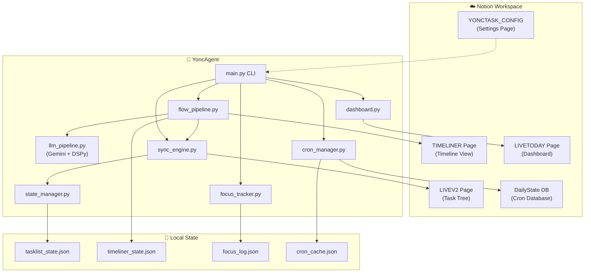
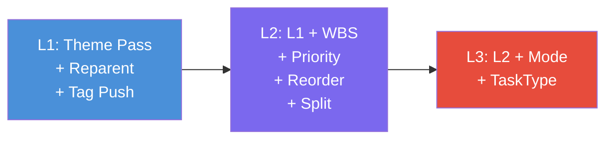
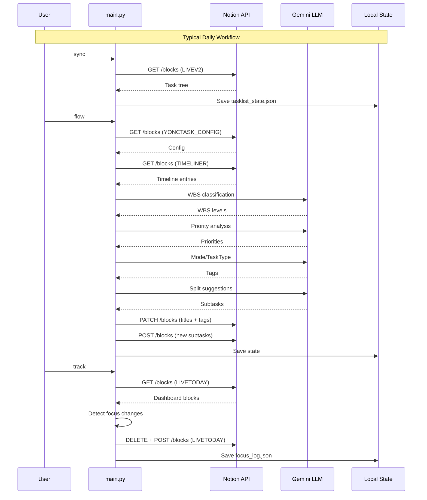

<div align="center">

# YoncAgent CLI 完全指南

**Notion Task Management System — Command Reference & Workflow Guide**

`v2.0` · Last updated: 2026-04-22

</div>

---

## Table of Contents

- [Architecture Overview](#architecture-overview)
- [Prerequisites](#prerequisites)
- [Global Options](#global-options)
- [Quick Start](#quick-start)
- [Command Reference](#command-reference)
  - [Core Flow Commands](#1-core-flow-commands)
    - [`flow`](#flow)
    - [`flow-l1`](#flow-l1)
    - [`flow-l2`](#flow-l2)
    - [`flow-l3`](#flow-l3)
  - [Sync & State Commands](#2-sync--state-commands)
    - [`sync`](#sync)
    - [`show-config`](#show-config)
  - [Focus & Tracking Commands](#3-focus--tracking-commands)
    - [`focus`](#focus)
    - [`track`](#track)
  - [Task Suggestion](#4-task-suggestion)
    - [`suggest`](#suggest)
  - [Timeline Management](#5-timeline-management)
    - [`timeliner`](#timeliner)
    - [`timeliner-diff`](#timeliner-diff)
  - [Daily State & Cron](#6-daily-state--cron-management)
    - [`daily`](#daily)
  - [Polling](#7-polling)
    - [`poll`](#poll)
  - [Legacy Wrappers](#8-legacy-wrappers)
    - [`push-sync`](#push-sync)
    - [`split`](#split)
    - [`tag`](#tag)
- [Data Flow Architecture](#data-flow-architecture)
- [State Files Reference](#state-files-reference)
- [Typical Workflows](#typical-workflows)
- [Troubleshooting](#troubleshooting)

---

## Architecture Overview

YoncAgent is a CLI-driven automation layer that sits between you and your Notion workspace. It reads tasks from a Notion page tree, applies AI-powered analysis (via Gemini + DSPy), and writes enriched metadata back to Notion — all managed through staged pipelines.



### Core Concepts

| Concept | Description |
|---------|-------------|
| **WBS Level** | Work Breakdown Structure hierarchy (L1 Goal → L2 Deliverable → L3 Work Package → L4 Activity) |
| **Theme** | Project grouping with colour-coding (e.g. `科研人`, `破壁人`) |
| **Mode** | Energy-level-based task categorisation (e.g. `💻Focus`, `🧠Deep`) |
| **Task Type** | Functional category (e.g. `🔍 测试`, `❓ 探索`) |
| **TIMELINER Scope** | The subset of tasks that appear on the TIMELINER page, used to determine which tasks the flow pipeline operates on |
| **Focus** | The single task you're currently working on, tracked via `💪🏿💪🏿💪🏿` emoji |

---

## Prerequisites

### 1. Environment Setup

```bash
# Clone & install
git clone https://github.com/alandelone/yonc_agent.git
cd yonc_agent
pip install -r requirements.txt
```

### 2. Environment Variables (`.env`)

```env
NOTION_TOKEN=secret_xxx                          # Notion Integration Token
YONCTASK_CONFIG_PAGE_ID=318e1eb5...              # Config page ID
DFORGE_LINESV2_PAGE_ID=318e1eb5...               # Task tree page ID  
TIMELINER_PAGE_ID=318e1eb5...                    # Timeline page ID
LIVETODAY_PAGE_ID=33ae1eb5...                    # Dashboard page ID
DAILYSTATE_DB_ID=347e1eb5...                     # DailyState database ID
```

### 3. LLM API Keys

Add Gemini keys to `unlimited_llmapi/api_keys.json`:

```json
[
  {"key": "YOUR_KEY_1", "model": "gemini-2.0-flash"},
  {"key": "YOUR_KEY_2", "model": "gemini-2.0-flash"}
]
```

---

## Global Options

All commands accept a global `--log-level` option:

```bash
python main.py --log-level DEBUG <command>
```

| Option | Values | Default | Description |
|--------|--------|---------|-------------|
| `--log-level` | `DEBUG`, `INFO`, `WARNING`, `ERROR` | `INFO` | Controls verbosity of console and file logging |

**Log files** are written to `data/logs/`:
- `data/logs/yonc_agent.log` — Rotating application log (5MB × 5 backups)
- `data/logs/flow_runs/` — Per-run flow traces (for `flow`, `flow-l*`, `push-sync`, `split`, `tag` commands)
- `data/logs/flow_runs/flow_latest.log` — Symlink to the most recent flow trace

---

## Quick Start

```bash
# 1. Pull latest state from Notion
python main.py sync

# 2. Run the full AI pipeline (Theme → WBS → Priority → Mode → Split)
python main.py flow

# 3. Update your live dashboard
python main.py track

# 4. Start focusing on task #3
python main.py focus --move 3

# 5. Check what you should do next at energy level 2
python main.py suggest --max-level 2
```

---

## Command Reference

---

### 1. Core Flow Commands

The flow pipeline is the heart of YoncAgent. It processes tasks through staged LLM passes that progressively enrich task metadata.



---

#### `flow`

**Run the complete staged pipeline (L1 → L2 → L3) in a single pass.**

```bash
python main.py flow
```

**What it does (in order):**

1. Fetch & merge task tree from Notion
2. **Theme Pass** — Match tasks to configured themes via context headings and title keywords
3. **Reparent Theme Containers** — Move misplaced tasks under their correct theme heading
4. **TIMELINER Scope** — Build the active scope from TIMELINER page entries (determines which tasks are processed)
5. **WBS Pass** — Classify Work Breakdown Structure levels (L1–L4) for scoped tasks via LLM
6. **Priority Pass** — Assign priority emojis based on timeliner rank and subproject status
7. **Mode / TaskType Pass** — Assign energy-level Modes and Task Type labels via LLM
8. **Root Reorder** — Sort root-level tasks by their TIMELINER rank
9. **Push Tags to Notion** — Write enriched titles (WBS emoji + Theme badge + Mode tag + title) back to Notion
10. **Split Suggestion** — LLM-powered decomposition of high-level tasks into L4 atomic actions
11. Save state to `data/tasklist_state.json`

**When to use:** Full pipeline refresh. Run this when you've added new tasks to Notion or need a complete re-analysis.

> [!WARNING]
> This command makes multiple Notion API calls and LLM requests. It can take 1–5 minutes depending on the number of scoped tasks.

---

#### `flow-l1`

**Run only the L1 (lightest) stage of the pipeline.**

```bash
python main.py flow-l1
```

**What it does:**

1. Fetch & merge task tree
2. Theme Pass — Assign theme labels & colours
3. Reparent Theme Containers
4. Push Tags to Notion (formatting only, no LLM metadata)
5. Save state

**When to use:** Quick formatting refresh. Fixes theme misassignments and title formatting without invoking the LLM.

**Typical runtime:** 10–30 seconds

---

#### `flow-l2`

**Run L1 + the L2 enrichment stage.**

```bash
python main.py flow-l2
```

**What it does (beyond L1):**

1. Bootstrap TIMELINER cache if needed (auto-runs `timeliner` if cache is >10 min old)
2. Build TIMELINER scope
3. **WBS Pass** — LLM classifies each scoped task's WBS level
4. **Priority Pass** — Assigns priority emojis (🔸🔶🟧🏭⬛) based on TIMELINER rank; subproject tasks get forced to the lowest priority
5. Root task reorder by TIMELINER rank
6. Push tags & title formatting
7. **Split Suggestion** — Decomposes eligible tasks (WBS < L4, not checked, not already split) into subtasks via LLM, creates them in Notion
8. Save state

**When to use:** After adding new tasks that need WBS classification and priority assignment.

**Split conditions** (a task must satisfy ALL):
- In the TIMELINER scope
- Not already split (`split_stage` ≠ `suggested` / `processed`)
- Not checked / completed
- Not AI-generated (`is_generated` = false)
- Notion type is `bulleted_list_item`, `bullet`, or `toggle`
- WBS level < 4
- Title contains at least one alphanumeric character after cleaning

---

#### `flow-l3`

**Run L1 + L2 (without split) + the L3 enrichment stage.**

```bash
python main.py flow-l3
```

**What it does (beyond L2 — without Split):**

1. Everything from L2 except Split Suggestion
2. **Mode / TaskType Pass** — LLM assigns:
   - **Modes**: Energy-level-based labels (e.g. `💻Focus`, `🧠Deep`, `📱Ambient`)
   - **Task Types**: Functional categories (e.g. `🔍 测试`, `❓ 探索`, `🔧 修复`)
3. Push all tags
4. Save state

**When to use:** When tasks need Mode and TaskType classification. This is required before tasks appear on the dashboard or in `suggest` output.

---

### 2. Sync & State Commands

---

#### `sync`

**Pull the latest state from Notion without applying any LLM processing.**

```bash
python main.py sync
```

**What it does:**

1. Check for dashboard updates (sync checked tasks from LIVETODAY → LIVEV2)
2. Fetch the full task tree from the LIVEV2 Notion page
3. Flatten the tree and run `sync_from_notion()` to reconcile remote vs local state
4. Merge states and save to `data/tasklist_state.json`

**When to use:**
- Before inspecting local state files
- When you've made manual changes in Notion and want to pull them locally
- As a prerequisite check before running flow commands

**Does NOT:**
- Invoke any LLM
- Modify anything in Notion
- Change task titles or tags

---

#### `show-config`

**Print the fully parsed `YONCTASK_CONFIG` to stdout as JSON.**

```bash
python main.py show-config
```

**Output includes:**

```json
{
  "themes": {
    "科研人": { "name": "科研人", "sub_themes": ["RstV4", ...], "color": "red" }
  },
  "modes": [
    { "level": 3.3, "mode_name": "💻Focus", "description": "...", "annotations": {...} }
  ],
  "priorities": { "🔸": "P1", "🔶": "P2", ... },
  "task_states": { "🚨": "Urgent", ... },
  "task_types": { "🔍": { "name_cn": "测试", "description": "..." } },
  "wbs_levels": { "1": { "emoji": "🔸", "label": "Level 1 Goal" } }
}
```

**When to use:** Debugging configuration issues, verifying that the Notion config page is being parsed correctly.

---

### 3. Focus & Tracking Commands

The Focus system lets you mark a single task as your current work item. Time spent on each task is automatically tracked.

---

#### `focus`

**View, move, sync, or complete the current focus task.**

```bash
# Show focusable task list with current focus indicator
python main.py focus

# Move focus to task number N
python main.py focus --move <N>

# Sync focus time history to tasklist_state metrics
python main.py focus --synctime

# Mark current focus as done (check in Notion + end session)
python main.py focus --done
```

| Option | Type | Description |
|--------|------|-------------|
| `--move <N>` | `int` | Move focus to task index N (1-based, from the task list) |
| `--synctime` | flag | Sync completed focus periods from `focus_log.json` → `tasklist_state.json` `metrics.timetaken[]` |
| `--done` | flag | End the current focus session, check the task in Notion, and sync time |

##### No arguments — List tasks

```
Task List (💪🏿💪🏿💪🏿 = current focus)
--------------------------------------------------
    1. 科研人 🚨 RstV4 Task A
    2. 科研人 🚨 RstV4 Task B 💪🏿💪🏿💪🏿
    3. 破壁人 Task C

Usage: python main.py focus --move <N> | --synctime
```

##### `--move <N>` — Switch focus

When you move focus:
1. The previous focus session is ended (timestamp recorded)
2. A new focus session starts on the target task
3. The LIVETODAY dashboard is rewritten with the `💪🏿💪🏿💪🏿` marker on the new task
4. **Remaining duration** is calculated and displayed:
   - `duration = estimated_time_h - Σ(timetaken periods)`
   - If no estimate exists, defaults to 30 minutes

```
Focus moved to [3] 破壁人 Task C (dashboard: 42 blocks)
duration: 45min
```

##### `--done` — Complete current focus

1. Ends the timing session
2. Syncs accumulated time to `tasklist_state.json`
3. Checks the task's `to_do` checkbox in Notion
4. Rewrites the dashboard (removes `💪🏿💪🏿💪🏿` marker)

---

#### `track`

**Full dashboard refresh: detect focus changes, sync checks, rewrite dashboard.**

```bash
python main.py track
```

**What it does (in order):**

1. **Pre-sync** — Check for newly checked tasks on LIVETODAY, push those checks back to LIVEV2
2. Fetch task tree from Notion
3. Load and merge local state
4. Build a provisional dashboard to detect where the user placed the `💪🏿💪🏿💪🏿` emoji
5. **Focus detection** — Compare detected focus with stored focus log:
   - If focus moved → end old session, start new one
   - If focused task was completed → auto-stop focus
   - If focus emoji removed → end session (idle state)
6. **Rewrite dashboard** — Clear the LIVETODAY page and write fresh blocks:
   - **By Modes** column — Tasks grouped by energy mode
   - **By Task Type** column — Same tasks grouped by functional type
   - Each task is a `to_do` block with rich-text formatting: `[N] Theme Mode TypeEmoji Title : description`
7. **Auto-sync time** — Sync any completed focus sessions to the `timetaken` metrics

**Dashboard layout:**

```
┌─────────────── LIVETODAY ──────────────────┐
│ 💪🏿💪🏿💪🏿  (idle marker, or on focused task)   │
│                                             │
│  By Modes              By Task Type         │
│  ─────────             ──────────           │
│  💻Focus (5 tasks)     🔍 测试 (3 tasks)    │
│  ☐ [1] 科研人 Task A   ☐ [1] 科研人 Task A  │
│  ☐ [2] 科研人 Task B   ☐ [4] 破壁人 Task D  │
│  ...                   ...                  │
│  🧠Deep (3 tasks)      ❓ 探索 (4 tasks)    │
│  ☐ [6] Task F          ☐ [2] Task B         │
│  ...                   ...                  │
└─────────────────────────────────────────────┘
```

**When to use:** Periodically (or via `poll`) to keep your dashboard in sync and track time automatically.

> [!TIP]
> You can manually drag the `💪🏿💪🏿💪🏿` bullet on the LIVETODAY page in Notion. The next `track` run will detect the new position and update the focus log accordingly. Drag it to the top idle zone to enter idle mode.

---

### 4. Task Suggestion

---

#### `suggest`

**Show a filtered task list based on your current energy level.**

```bash
# List all available energy levels
python main.py suggest

# Show tasks at exact energy level 3.3
python main.py suggest --level 3.3

# Show all tasks at or below energy level 2
python main.py suggest --max-level 2
```

| Option | Type | Description |
|--------|------|-------------|
| `--level <N>` | `float` | Exact energy level match (e.g. `3.3`, `2`, `1`) |
| `--max-level <N>` | `float` | Show tasks at or below this energy level |

##### No arguments — List available energy levels

```
Available energy levels (from YONCTASK_CONFIG Modes):
────────────────────────────────────────────────────────────
  Lv3.3  💻Focus          High concentration coding/writing
  Lv2    🧠Deep           Medium effort research/planning
  Lv1    📱Ambient        Low energy browsing/organizing

Usage: python main.py suggest --level <N> | --max-level <N>
```

##### With `--level` or `--max-level` — Filtered task list

```
Suggested tasks for energy ≤Lv2  (12 tasks)
════════════════════════════════════════════════════════════

  ── 🧠Deep (Lv2, 5 tasks) ──
      1. 科研人 🚨 RstV4 Literature Review
      2. 破壁人 API Design Document
      ...

  ── 📱Ambient (Lv1, 7 tasks) ──
      6. 科研人 Organise Reference Papers
      7. 破壁人 Update README
      ...
```

**Filter criteria:**
- WBS Level = 4 (atomic actions only)
- Has a Mode tag assigned
- `generated_selection_processed` = true (approved after split)
- Not checked / completed

---

### 5. Timeline Management

The TIMELINER system tracks project deadlines, completion percentages, and date change history.

---

#### `timeliner`

**Sync the TIMELINER Notion page with current progress metrics.**

```bash
python main.py timeliner
```

**What it does:**

1. Fetch all timeline entries from the TIMELINER page
2. Load task state to calculate per-subtheme metrics:
   - **Completion %** = completed leaf tasks / total leaf tasks
   - **Total time** = sum of `estimated_time_h` across leaf tasks
3. Load date audit baseline to detect deadline changes
4. For each entry:
   - Detect settle date changes → record to audit log
   - Resolve status emoji based on extension count (🟢 → 🟡 → 🔴)
   - Compute remaining work days
5. **Rewrite each TIMELINER block** with rich text:
   ```
   🟢 科研人 / RstV4 TaskName Takes 🏁dates 20h  || 45%
   Settle by @2026-05-01, but 🔜 9 day
   ```
6. Save timeliner state cache

**When to use:** After completing tasks or when deadlines change.

---

#### `timeliner-diff`

**Show the history of all deadline changes in a git-diff style format.**

```bash
python main.py timeliner-diff
```

**Output:**

```
[2026-04-15] 科研人 / RstV4 / Literature Review
  - Settle by: 2026-04-20
  + Settle by: 2026-04-25
  (Extension #1: 🟢 → 🟡)

[2026-04-18] 破壁人 / API Design
  - Settle by: 2026-04-22
  + Settle by: 2026-05-01
  (Extension #2: 🟡 → 🔴)
```

**Data source:** `data/timeliner_audit.jsonl` (append-only audit log)

---

### 6. Daily State & Cron Management

The `daily` command is a multi-mode interface for the DailyState Notion database, which tracks daily habits, check-ins, and cron-scheduled activities.

---

#### `daily`

```bash
python main.py daily [mode] [options]
```

**Available modes:**

| Mode | Description |
|------|-------------|
| `read` (default) | Show today's DailyState page properties |
| `write` | Update a property on today's page |
| `schema` | Show the database schema with multi_select options |
| `cron-dash` | List upcoming crons within a 1.5-hour time window |
| `cron-query` | Query cron details by name or type |
| `cron-post` | Check / update a cron property (smart auto-increment) |

**Common options:**

| Option | Type | Description |
|--------|------|-------------|
| `--prop <name>` | `str` | Property name for read/write |
| `--value <val>` | `str` | Value to set (write/cron-post) |
| `--date <YYYY-MM-DD>` | `str` | Target date (default: today) |
| `--time <HH:MM>` | `str` | Override current time (cron-dash) |
| `--cron-name <name>` | `str` | Cron name (`name_in_db`) for query/post |
| `--cron-type <type>` | `str` | Cron type filter for query |

---

##### `daily read` — Read properties

```bash
# Show all properties for today
python main.py daily read

# Show all properties for a specific date
python main.py daily read --date 2026-04-20

# Show a single property
python main.py daily read --prop "晨仪:💊"
```

**Output (all properties):**

```
 DailyState for 2026-04-22  (page: ...3da6)
════════════════════════════════════════════════════════════
  Morning Routine            [checkbox    ]  = True
  Sleep Hours                [number      ]  = 7.5
  Gratitude                  [rich_text   ]  = Grateful for good weather
  Tags                       [multi_select]  = Reading, Exercise
```

---

##### `daily write` — Update a property

```bash
# Set a checkbox
python main.py daily write --prop "Morning Routine" --value true

# Set a number
python main.py daily write --prop "Sleep Hours" --value 7.5

# Set multi_select tags (comma-separated)
python main.py daily write --prop "Tags" --value "Reading,Gym,Meditation"

# Set rich_text
python main.py daily write --prop "Notes" --value "Today was productive"
```

**Supported property types:** `checkbox`, `number`, `multi_select`, `rich_text`

**Value parsing:**
| Type | Input Format | Examples |
|------|-------------|----------|
| `checkbox` | `true`/`false`/`1`/`0`/`yes`/`no` | `--value true` |
| `number` | Numeric string | `--value 7.5`, `--value 42` |
| `multi_select` | Comma-separated names | `--value "Tag1,Tag2"` |
| `rich_text` | Any string | `--value "Hello World"` |

---

##### `daily schema` — Show database schema

```bash
python main.py daily schema
```

**Output:**

```
 Database Schema (15 properties)
════════════════════════════════════════════════════════════
  Morning Routine              [checkbox]
  Sleep Hours                  [number]
  Tags                         [multi_select]  options: ['Reading', 'Gym', 'Meditation']
  Notes                        [rich_text]
```

---

##### `daily cron-dash` — Upcoming crons dashboard

```bash
# Show crons due now (1.5h window)
python main.py daily cron-dash

# Override time for debugging
python main.py daily cron-dash --time 09:30
```

**Output:**

```
CRON_DASH | 2026-04-22 15:00 | 2 pending / 4 total
───────────────────────────────────────────────────────
  [UNDONE] 午休:运动  (trace, checkbox)  @14:00
  [DONE]   下午茶:💊  (trace, checkbox)  @15:00
  [UNDONE] 专注时段    (traceXlt, number)  @14-18
  [DONE]   阅读打卡    (trace, multi_select)  @14:00
```

**Filter logic:**
- Only shows crons where `start_hour ≤ now`
- Within the past `window_hours` (default 1.5h)
- For ranged crons (e.g. `14-18`): visible as long as `now ≤ end_hour`
- Queries DailyState DB to determine `[DONE]`/`[UNDONE]` status

**Cron entry format in YONCTASK_CONFIG:**

```
{start_hour}[-{end_hour}].{section} | {type} | {name_in_db} | {description}
```

Examples:
```
8.1 | trace | 晨仪:💊 | Eat Medi, Supplement
9-18.3 | traceXlt | 专注时段 | Deep work focus blocks
```

---

##### `daily cron-query` — Query cron details

```bash
# Query by exact name
python main.py daily cron-query --cron-name "晨仪:💊"

# Query by type
python main.py daily cron-query --cron-type trace

# List all crons
python main.py daily cron-query
```

**Output:**

```
CRON: 晨仪:💊
  time: 08:00
  type: trace
  db_type: checkbox
  description: Eat Medi, Supplement
```

---

##### `daily cron-post` — Check / update a cron

```bash
# Checkbox cron → auto-set to True
python main.py daily cron-post --cron-name "晨仪:💊"

# Number cron → auto-increment (+1)
python main.py daily cron-post --cron-name "专注时段"

# Number cron → set explicit value
python main.py daily cron-post --cron-name "专注时段" --value 3

# Multi-select cron → increment counter for specific task
python main.py daily cron-post --cron-name "阅读打卡" --value "断水"

# Multi-select cron → list available task names
python main.py daily cron-post --cron-name "阅读打卡"
```

**Auto-behaviour by property type (when no `--value`):**

| Property Type | Behaviour | Example |
|--------------|-----------|---------|
| `checkbox` | → `True` | ✅ 晨仪:💊 = True |
| `number` | → current + 1 | ✅ 专注时段 = 2 → 3 |
| `rich_text` | → Error (requires `--value`) | 📝 Notes requires --value |
| `multi_select` | → Show available task names | 📋 Select task name(s)... |

**Multi-select counter pattern:**

The cron system supports a unique counter pattern for `multi_select` properties:
- Options are named `{N} X {task_name}` (e.g. `"1 X 断水"`, `"3 X pc练习"`)
- `cron-post` increments the counter: `"1 X 断水"` → `"2 X 断水"`
- New task names start at `"1 X {name}"`

---

### 7. Polling

---

#### `poll`

**Start a continuous polling loop that runs `sync` at regular intervals.**

```bash
python main.py poll
```

**Behaviour:**
- Runs `cmd_sync()` every `POLL_INTERVAL_SECONDS` (default: 60 seconds, configured in `config.py`)
- Continues until interrupted with `Ctrl+C`

**When to use:** Background sync daemon for continuous state tracking.

> [!NOTE]
> `poll` only runs `sync`, not the full flow pipeline. For automated flow execution, consider setting up a separate cron/scheduled task.

---

### 8. Legacy Wrappers

These commands exist for backward compatibility. They redirect to the modern flow pipeline stages.

---

#### `push-sync`

```bash
python main.py push-sync
# Equivalent to: python main.py flow-l1
```

Legacy name for the L1 flow stage.

---

#### `split`

```bash
python main.py split
# Equivalent to: python main.py flow-l2
```

Legacy name for the L2 flow stage (includes WBS + Split).

---

#### `tag`

```bash
python main.py tag
# Equivalent to: python main.py flow-l3
```

Legacy name for the L3 flow stage (includes Mode + TaskType tagging).

---

## Data Flow Architecture



---

## State Files Reference

All state files live in the `data/` directory:

| File | Format | Description |
|------|--------|-------------|
| `tasklist_state.json` | JSON Array | Master task state — each task has `id`, `title`, `wbs_level`, `tags`, `metrics`, etc. |
| `timeliner_state.json` | JSON Object | Cached TIMELINER scope with `main_projects`, `sub_projects`, and last sync time |
| `timeliner_audit.jsonl` | JSONL | Append-only audit log of deadline changes |
| `focus_log.json` | JSON Object | Current focus session (`current_focus`) and completed sessions (`history[]`) |
| `livetoday_map.json` | JSON Object | Maps dashboard `[N]` indices to original LIVEV2 block IDs |
| `dash_checked_today.json` | JSON Object | Tracks which tasks were checked on the dashboard today |
| `cron_cache.json` | JSON Object | Cached parsed cron entries (expires after 24h) |
| `current_state.json` | JSON Object | Snapshot of Notion-side state from last `sync_from_notion()` |

---

## Typical Workflows

### 📅 Morning Routine

```bash
# 1. Pull overnight changes
python main.py sync

# 2. Check morning crons
python main.py daily cron-dash

# 3. Complete morning habits
python main.py daily cron-post --cron-name "晨仪:💊"

# 4. See what's on the plate
python main.py suggest --max-level 2

# 5. Pick a task and start focusing
python main.py focus --move 3
```

### 🔄 After Adding New Tasks in Notion

```bash
# 1. Run the full pipeline to analyse new tasks
python main.py flow

# 2. Refresh the dashboard
python main.py track
```

### ✅ Completing a Task

```bash
# Option A: Mark done from CLI
python main.py focus --done

# Option B: Check the to_do box on LIVETODAY in Notion
#           Then run track to sync
python main.py track
```

### 📊 End-of-Day Review

```bash
# 1. Sync any remaining focus time
python main.py focus --synctime

# 2. Update timeline progress
python main.py timeliner

# 3. Check for deadline slips
python main.py timeliner-diff

# 4. Review daily property state
python main.py daily read
```

### 🔧 Debugging Issues

```bash
# Check config parsing
python main.py show-config

# Run with debug logging
python main.py --log-level DEBUG flow-l1

# Check the latest flow trace
cat data/logs/flow_runs/flow_latest.log
```

---

## Troubleshooting

### Common Issues

| Symptom | Cause | Solution |
|---------|-------|----------|
| `No tasks found in Notion` | LIVEV2 page is empty or page ID is wrong | Check `DFORGE_LINESV2_PAGE_ID` in `.env` |
| `TIMELINER cache missing` | First run or cache expired (>10 min) | Run `python main.py timeliner` manually, or let flow auto-bootstrap |
| Tasks not appearing on dashboard | Tasks lack Mode tags or WBS ≠ 4 | Run `python main.py flow-l3` to assign Modes |
| `suggest` returns empty | No L4 tasks with `generated_selection_processed = true` | Run `python main.py flow` then manually review suggested tasks |
| Duplicate tags in titles | Multiple flow runs stacking tags | Run `python main.py flow-l1` to clean and reformat |
| `400 Client Error` on Notion API | Malformed rich_text or invalid block structure | Check `data/logs/yonc_agent.log` for the full error payload |
| Focus not detected | `💪🏿💪🏿💪🏿` emoji variant mismatch | Ensure you use the exact emoji from the dashboard (with skin tone modifier) |

### Log Files

```bash
# Application log (rotating, always written)
data/logs/yonc_agent.log

# Flow-specific trace (per-run)
data/logs/flow_runs/flow-l2_20260422_150000_12345.log

# Latest flow trace (overwritten each run)
data/logs/flow_runs/flow_latest.log
```

---

<div align="center">

*Built for INTP + ADHD brains. Outsource the executive function, keep the creativity.* 🧠⚡

</div>
