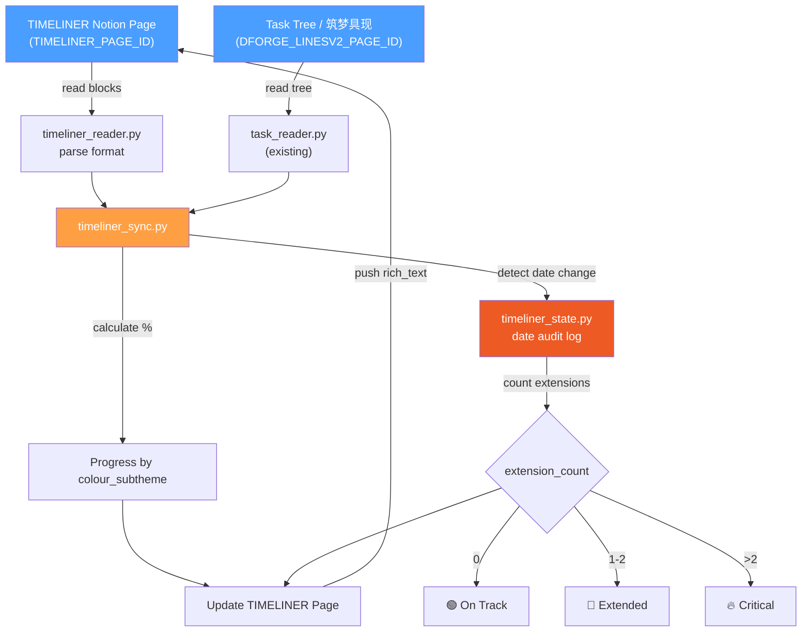

# TIMELINER Implementation Plan

> **For Claude:** REQUIRED SUB-SKILL: Use superpowers:executing-plans to implement this plan task-by-task.

**Goal:** Build a timeline dashboard module that reads a dedicated Notion page (`TIMELINER_PAGE_ID`), parses project/subproject entries with dates and progress, syncs completion percentages from the task tree (筑梦具现), and tracks date extensions with a git-diff-like audit trail.

**Architecture:** TIMELINER is a _read-from-two-sources, write-to-one_ pipeline. It reads structured timeline entries from a dedicated Notion page and cross-references them with the existing task tree (DFORGE_LINESV2) to calculate real progress by `colour_subtheme`. Date changes are tracked in a local JSONL audit log with escalating status indicators (🟢→🔴→🔥). A new CLI command `timeliner` orchestrates the full sync cycle.

**Tech Stack:** Python 3.10+, Notion API (existing `notion_client.py`), JSON/JSONL for state, `re` for format parsing, ISO 8601 dates via `datetime`

---

## User Review Required

> [!IMPORTANT]
> **`TIMELINER_PAGE_ID` is currently set to the same value as `DFORGE_LINESV2_PAGE_ID`** in `.env`. You need to create the actual TIMELINER Notion page and update this ID before running the feature. The plan assumes a separate page.

> [!IMPORTANT]
> **Notion page structure assumption:** The TIMELINER page is expected to use `heading_2` or `heading_3` blocks for Main Project / Sub Project grouping, and `bulleted_list_item` or `paragraph` blocks for each timeline entry in the format:
> ```
> 🟢**{colour_subtheme}** Takes `🏁dates h`{time_expected}  ||{percent}% Settle by March 30, 2026, but 🔜 {remaining_work_days}
> ```

> [!WARNING]
> **Date extension tracking** uses a local JSONL file (`data/timeliner_date_audit.jsonl`), not Notion properties. This means the audit history is local-only and tied to the machine running the agent. Back up `data/` if needed.

---

## System Architecture



---

## Data Model

### Timeline Entry (parsed from Notion)

```python
@dataclass
class TimelineEntry:
    block_id: str                    # Notion block ID
    project: str                     # 从 heading 继承的 Main Project 名
    subproject: str                  # 从 heading 继承的 Sub Project 名
    colour_subtheme: str             # 从 🟢**{value}** 提取
    status_emoji: str                # 🟢 / 🔴 / 🔥
    settle_date: str                 # ISO 8601 日期 (e.g. "2026-03-30")
    time_expected_h: float | None    # 🏁dates h 后的预期小时数
    percent: int                     # 当前完成百分比 (0-100)
    remaining_work_days: int | None  # 🔜 后的剩余工作日
    raw_text: str                    # 原始 Notion 文本
```

### Date Audit Entry (JSONL)

```python
{
    "timestamp": "2026-04-06T08:00:00Z",
    "block_id": "abc123",
    "colour_subtheme": "健身",
    "field": "settle_date",
    "old_value": "2026-03-30",
    "new_value": "2026-04-15",
    "extension_count": 1,           # 累计延期次数
    "status_change": "🟢 → 🔴"
}
```

---

## Proposed Changes

### Component 1: Timeline Reader

Responsible for parsing the TIMELINER Notion page into structured `TimelineEntry` objects.

#### [NEW] [timeliner_reader.py](file:///c:/Users/Alandelone/CodeSpace_Local/yonc_agent/timeliner_reader.py)

Core parser that:
1. Fetches blocks from `TIMELINER_PAGE_ID` via existing `notion_client.get_page_blocks()`
2. Walks headings to track current project/subproject context
3. Parses each `bulleted_list_item` / `paragraph` using regex against the defined format
4. Returns `List[TimelineEntry]`

**Key regex pattern:**
```python
TIMELINER_PATTERN = re.compile(
    r"^(?P<status>[🟢🔴🔥])\s*"                         # 状态 emoji
    r"\*?\*?(?P<subtheme>[^*]+?)\*?\*?\s+"              # **colour_subtheme**
    r"Takes\s+`🏁[^`]*`\s*"                              # Takes `🏁dates h`
    r"(?P<time_h>[\d.]+)?\s*"                            # 可选的小时数
    r"\|\|\s*(?P<percent>\d+)%\s+"                       # ||{percent}%
    r"Settle\s+by\s+(?P<date>[A-Za-z]+\s+\d+,\s+\d+)"  # Settle by {date}
    r"(?:,?\s*but\s+🔜\s*(?P<remaining>\d+))?"          # 可选: 🔜 {remaining}
)
```

---

### Component 2: Timeline State & Audit

Manages date change history and status escalation logic.

#### [NEW] [timeliner_state.py](file:///c:/Users/Alandelone/CodeSpace_Local/yonc_agent/timeliner_state.py)

Responsibilities:
1. Load/save timeliner state (`data/timeliner_state.json`) — last known dates per `colour_subtheme`
2. Append to date audit log (`data/timeliner_date_audit.jsonl`) when dates change
3. Compute `extension_count` per subtheme from audit history
4. Determine status emoji: `0 → 🟢`, `1-2 → 🔴`, `>2 → 🔥`

```python
# 核心函数签名
def load_timeliner_state() -> Dict[str, Any]: ...
def save_timeliner_state(state: Dict[str, Any]) -> None: ...
def record_date_change(subtheme: str, old_date: str, new_date: str) -> int: ...
def get_extension_count(subtheme: str) -> int: ...
def resolve_status_emoji(extension_count: int) -> str: ...
```

---

### Component 3: Timeline Sync Engine

Cross-references the task tree with timeline entries to compute progress and push updates.

#### [NEW] [timeliner_sync.py](file:///c:/Users/Alandelone/CodeSpace_Local/yonc_agent/timeliner_sync.py)

Responsibilities:
1. **Progress calculation:** Walk the task tree (筑梦具现), group tasks by `colour_subtheme` (from tags `Task Theme with colour`), count completed vs total → percent
2. **Date change detection:** Compare parsed dates against stored state, record changes
3. **Status update:** Escalate 🟢→🔴→🔥 based on `extension_count`
4. **100% handling:** If percent = 100, format as ~~💯~~ (strikethrough)
5. **Push back:** Build `rich_text` payload and update each timeline block in Notion

```python
# 核心函数签名
def calculate_progress_by_subtheme(task_tree: List[Dict]) -> Dict[str, ProgressInfo]: ...
def sync_timeliner() -> None: ...        # 主入口
def build_timeliner_rich_text(entry: TimelineEntry) -> List[Dict]: ...
```

**Progress calculation algorithm:**
```python
# 遍历任务树，匹配 colour_subtheme
for task in flattened_tasks:
    theme_tag = task.get("tags", {}).get("Task Theme with colour", "")
    # 从 theme_tag 中提取 subtheme 名
    # 匹配到 timeline entry 的 colour_subtheme
    # checked=True 或 title 包含 ✅ → completed
    # total++ , if completed → done++
# percent = (done / total) * 100
```

---

### Component 4: Git-Diff Date Tracker

A utility that provides git-diff style output for date changes.

#### [NEW] [timeliner_diff.py](file:///c:/Users/Alandelone/CodeSpace_Local/yonc_agent/timeliner_diff.py)

Reads `timeliner_date_audit.jsonl` and formats it into a human-readable diff display:

```
[2026-04-01] 健身
  - Settle by: 2026-03-30
  + Settle by: 2026-04-15
  (Extension #1: 🟢 → 🔴)

[2026-04-05] 健身
  - Settle by: 2026-04-15
  + Settle by: 2026-05-01
  (Extension #2: 🔴 → 🔴)

[2026-04-06] 健身
  - Settle by: 2026-05-01
  + Settle by: 2026-06-01
  (Extension #3: 🔴 → 🔥)
```

```python
def format_date_diff(subtheme: str = None) -> str: ...
def print_date_diff_all() -> None: ...
```

---

### Component 5: CLI Integration

#### [MODIFY] [main.py](file:///c:/Users/Alandelone/CodeSpace_Local/yonc_agent/main.py)

Add two new commands:
- `timeliner` — Run the full timeliner sync cycle (read → progress calc → date check → push)
- `timeliner-diff` — Display git-diff style date change history

```python
def cmd_timeliner():
    """从 TIMELINER 页面读取时间线，从筑梦具现计算进度，推送更新"""
    from timeliner_sync import sync_timeliner
    sync_timeliner()

def cmd_timeliner_diff():
    """显示时间线日期变更的 git-diff 风格历史"""
    from timeliner_diff import print_date_diff_all
    print_date_diff_all()
```

Add to argparse:
```python
subparsers.add_parser("timeliner", help="Sync TIMELINER page with progress from task tree")
subparsers.add_parser("timeliner-diff", help="Show git-diff style date change history")
```

---

### Component 6: Config & Environment

#### [MODIFY] [config.py](file:///c:/Users/Alandelone/CodeSpace_Local/yonc_agent/config.py)

No changes needed — `TIMELINER_PAGE_ID` already exists. User must update `.env` with the correct page ID.

#### [MODIFY] [.env](file:///c:/Users/Alandelone/CodeSpace_Local/yonc_agent/.env)

User action required: Set `TIMELINER_PAGE_ID` to the actual Notion page ID.

---

### Component 7: Tests

#### [NEW] [tests/test_timeliner_reader.py](file:///c:/Users/Alandelone/CodeSpace_Local/yonc_agent/tests/test_timeliner_reader.py)

```python
def test_parse_standard_entry(): ...
def test_parse_entry_without_remaining_days(): ...
def test_parse_entry_100_percent_strikethrough(): ...
def test_parse_entry_with_fire_status(): ...
def test_heading_context_inheritance(): ...
```

#### [NEW] [tests/test_timeliner_state.py](file:///c:/Users/Alandelone/CodeSpace_Local/yonc_agent/tests/test_timeliner_state.py)

```python
def test_record_first_date_change(): ...
def test_extension_count_increments(): ...
def test_status_emoji_green(): ...
def test_status_emoji_red_at_2(): ...
def test_status_emoji_fire_at_3(): ...
```

#### [NEW] [tests/test_timeliner_sync.py](file:///c:/Users/Alandelone/CodeSpace_Local/yonc_agent/tests/test_timeliner_sync.py)

```python
def test_progress_calculation_simple(): ...
def test_progress_100_percent_format(): ...
def test_date_change_triggers_audit(): ...
def test_rich_text_output_format(): ...
```

#### [NEW] [tests/test_timeliner_diff.py](file:///c:/Users/Alandelone/CodeSpace_Local/yonc_agent/tests/test_timeliner_diff.py)

```python
def test_format_single_change(): ...
def test_format_multiple_changes(): ...
def test_filter_by_subtheme(): ...
```

---

## Open Questions

> [!IMPORTANT]
> 1. **`TIMELINER_PAGE_ID` 的实际 Notion 页面 ID 是什么？** 当前 `.env` 中与 `DFORGE_LINESV2_PAGE_ID` 相同，需要确认是否是同一页面还是需要创建新页面。

> [!IMPORTANT]
> 2. **`口日目田` 的触发方式是什么？** 是作为现有 `tag` 命令的一部分运行，还是 `timeliner` 命令本身就是 `口日目田` 的执行体？下面计划假定 `timeliner` 命令 = `口日目田` 的执行。

> [!WARNING]
> 3. **colour_subtheme 的匹配逻辑：** 是精确匹配任务树中的 `Task Theme with colour` tag 的 subtheme 部分，还是也包括主 theme 名？例如 tag 值为 `"我流方矩 婚姻 | 健身 | ..."` 时，`colour_subtheme = "健身"` 应该匹配到吗？

> [!NOTE]
> 4. **Remaining work days (`🔜`)：** 这个值是手动输入的还是需要自动计算（从今天到 settle_date 的工作日）？计划假定自动计算。

---

## Verification Plan

### Automated Tests

```bash
# 运行所有 timeliner 测试
pytest tests/test_timeliner_reader.py tests/test_timeliner_state.py tests/test_timeliner_sync.py tests/test_timeliner_diff.py -v

# 运行全部测试确保无回归
pytest tests/ -v
```

### Manual Verification

1. 确认 `.env` 中 `TIMELINER_PAGE_ID` 已更新为正确的 Notion 页面 ID
2. 运行 `python main.py timeliner` 观察输出是否正确读取和更新 TIMELINER 页面
3. 手动在 Notion 中修改一个 settle date，再次运行 `timeliner`，确认：
   - 🟢 变为 🔴
   - `timeliner_date_audit.jsonl` 中新增一条记录
4. 运行 `python main.py timeliner-diff` 确认 diff 输出格式正确
5. 重复修改 settle date 超过 2 次，确认状态变为 🔥

---

## Task Breakdown (Execution Order)

### Task 1: timeliner_reader.py — 格式解析器
- Create `timeliner_reader.py` with `TimelineEntry` dataclass and `parse_timeliner_page()` 
- Create `tests/test_timeliner_reader.py` with parser unit tests
- TDD: test → implement → verify

### Task 2: timeliner_state.py — 状态与审计日志
- Create `timeliner_state.py` with state load/save and date audit functions
- Create `tests/test_timeliner_state.py` with state management tests
- TDD: test → implement → verify

### Task 3: timeliner_diff.py — Git-Diff 风格日期追踪
- Create `timeliner_diff.py` with diff formatter
- Create `tests/test_timeliner_diff.py` with format tests
- TDD: test → implement → verify

### Task 4: timeliner_sync.py — 进度同步引擎
- Create `timeliner_sync.py` with progress calculation and Notion push
- Create `tests/test_timeliner_sync.py` with sync logic tests
- TDD: test → implement → verify

### Task 5: CLI 集成
- Modify `main.py` to add `timeliner` and `timeliner-diff` commands
- Manual end-to-end verification

### Task 6: Commit & Review
- Run full test suite
- Commit all changes
